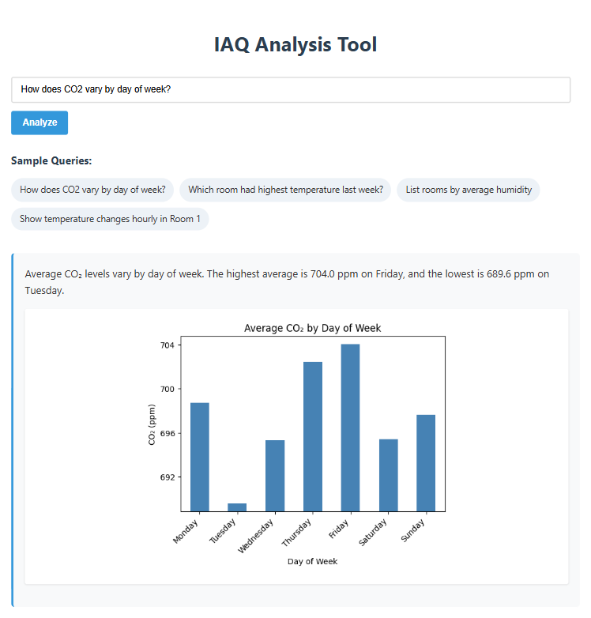

# Air Quality Sensor Analyzer

A full-stack AI Agent web app for analyzing air quality sensor data using natural language queries.

## Setup

1. Make sure you have Python 3.8+ installed
2. Install required dependencies:
   ```
   pip install -r requirements.txt
   ```
3. Ensure you have a `.env` file with your Hugging Face API token:
   ```
   HF_TOKEN=your_huggingface_token
   ```
4. Make sure your sensor data is in the `sensor-data` folder

## Usage

Run the application with a single command:

```
python app.py
```

Then open your browser to http://localhost:5000

## Sample Query and Output

- How does CO2 vary by day of week?


